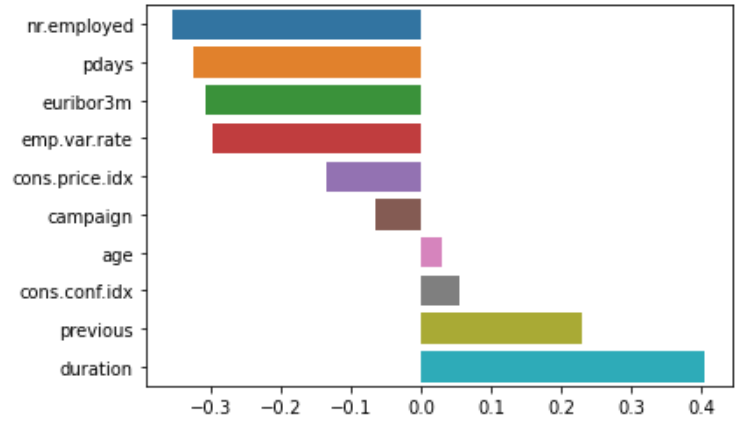
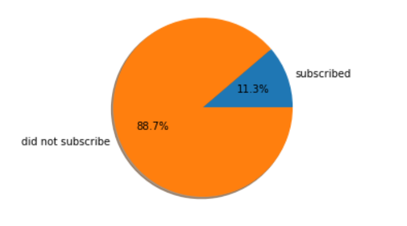

# Bank Marketing Campaign

Capstone Project - Concordia Data Science Bootcamp

### Overview:

In this project I used the ['Bank Marketing Data Set'](https://archive.ics.uci.edu/ml/datasets/Bank+Marketing) from the University of California, Irvine machine learning respository. The goal of this project is to use machine learning techniques to predict the success of a Portuguese bank's telemarketing calls for selling bank long-term deposits.

### Data:

The original dataset includes over 50,000 instances (collected in a five-year period from 2008 to 2013), and a wide set of features (150 features). Moro, Cortez and Rita (2014) mention that they used a semi-automatic feature selection to reduce the number of features to 22. However, in this project I used the most complete version of the publicly available version of the dataset that includes 41,188 instances and 20 features.

The response variable is a binary variable measuring whether the client subscribed to the bank or not. The set of features available in the dataset is:

 1 - age 
 2 - job 
 3 - marital status
 4 - education 
 5 - default: has credit in default? 
 6 - housing: has housing loan? 
 7 - loan: has personal loan? 
 8 - contact: contact communication type 
 9 - month: last contact month of year 
 10 - day_of_week: last contact day of the week 
 11 - duration
 12 - campaign: number of contacts performed during this campaign and for this client (numeric, includes last contact)
 13 - pdays: number of days that passed by after the client was last contacted from a previous campaign (numeric; 999 means client was not previously contacted)
 14 - previous: number of contacts performed before this campaign and for this client
 15 - poutcome: outcome of the previous marketing campaign 
 16 - emp.var.rate: employment variation rate
 17 - cons.price.idx: consumer price index 
 18 - cons.conf.idx: consumer confidence index 
 19 - euribor3m: euribor 3 month rate 
 20 - nr.employed: number of employees

### Data Cleaning and Preprocessing steps:

Cleaning:

- The dataset comes with no missing values. 
- There are twelve duplicates which must be removed. 
- Some categorical vaiables have many categories, which makes it difficult for the models to distinguish the effect of each. Therefore, in some cases categories that are close to each other are merged together. 
- The variable 'Campaign' is skewed. Therefore, I put a maximum (mean of Campaign + 2.3 * std(Campaign))for this variable (i.e., all Campaigns>9 are converted to 9).
- Around 90% of the instances have a pdays = 999 (meaning they had not been previously contacted). So, I converted pdays to a binary variable (0 = they had not been contacted before, 1 = they had).

Preprocessing: 

Since most machine learning models work well when the range of features are relatively the same. I used StandardScaler to scale the data.

### Distribution of the response variable:

As we can see the distribution of the response variable is imbalanced. Therefore, we need to take some actions to deal with this issue:
 1- We need to make sure that the distribution of the response variable is similar across train, validation and test sets.
 2- We need to use Undersampling or Oversampling. Alternatively, most models include a class_weight hyperparameter that we can set equal to 'balanced' to deal with the issue.

### Metrics used to evaluate the performance:

Since the data is imbalanced, using accuracy can be misleading. For example, in this project a model that classifies everyone as someone who does not subscribe to the bank can get a 88.7% accuracy, while having no real value.
To tackle this problem, I use two metrics for performance evaluation of the model:
 1- Balanced Accuracy Score: The balanced accuracy in binary and multiclass classification problems to deal with imbalanced datasets. It is defined as the average of recall (tp/(tp + fn)) obtained on each class (sklearn documentation). Therefore, such classification (0 to everyone) would result in a balanced accuracy score of 50%.
 2- AUC: shows how much model can distinguish the two different classes.

### Models used for analysis:
 1- Logistic Regression
 2- Support Vector Machines
 3- Decision Trees
 4- An Ensemble which uses all three models. 

### Performance on the Validation data:
Model | Logistic Regression | SVM | Decision Trees | Ensemble 
--- | --- | --- | --- |--- 
Balanced Accuracy | 72.11% | 72.63% | 69.52% | 72.1%

### Performance on the Unseen data:
I chose the logistic regression as the best predictor. It has a balanced accuracy score of 73.8% on the useen data, and an AUC score of 0.79. 
Moro, Cortez and Rita (2014) model slightly performed better. Why?

There are a couple of possible answers for this question:
 1- They had over 11,000 more instances than me.
 2- They had more features available.
 3- Although their data is imbalanced, it is still more balanced than mine.

References:
1 - S. Moro, P. Cortez and P. Rita. A Data-Driven Approach to Predict the Success of Bank Telemarketing. Decision Support Systems, Elsevier, 62:22-31, June 2014.

